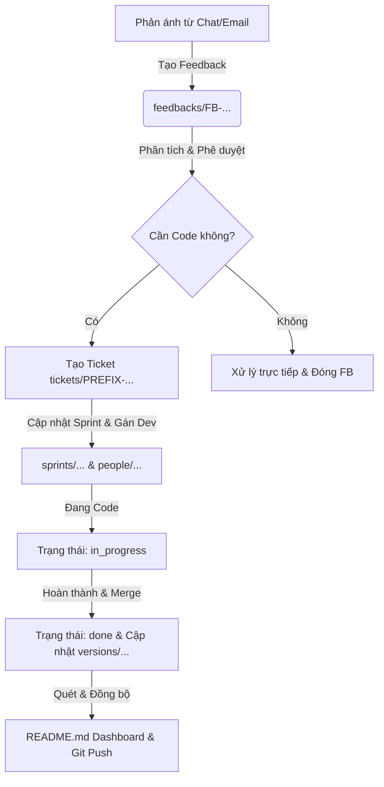

# 🤖 PM Agent - Setup & Operating Guide

[](https://github.com/starrynighthn/pm-agent)
[](#-buy-me-a-beer)

Chào mừng bạn đến với bộ khung **PM Agent**. Đây là giải pháp quản lý dự án dạng **Single Source of Truth (SSOT)** dựa trên các tệp tin Markdown kết hợp đồng bộ Git, được thiết kế tối ưu hóa để vận hành bởi các AI Agent thông minh (Gemini, DeepSeek, Claude, v.v.).

Bộ sản phẩm này giúp bạn và AI Agent tự động hóa hoàn toàn các thao tác nghiệp vụ dự án từ thu thập phản ánh, phân tích yêu cầu nghiệp vụ đến gán task, cập nhật Sprint, Version và kết xuất số liệu Dashboard tự động.

---

## 📁 Cấu trúc Thư mục Đóng gói

```text
├── AGENTS.md               # Quy tắc cốt lõi & cơ chế vận hành của AI Agent
├── README.md               # Tài liệu hướng dẫn cài đặt & vận hành này (Setup Guide)
├── rules/                  # Thư mục chứa các quy tắc quản lý nghiệp vụ chi tiết
│   ├── project-rules.md     # Quy định chung về định dạng, liên kết và phân vai
│   ├── workflow-rules.md    # Định nghĩa vòng đời Ticket (backlog -> done)
│   ├── validation-rules.md  # Quy định xác thực thông tin trước khi lưu
│   ├── requirement-rules.md # Quy định quản lý và convert các Yêu cầu (REQ)
│   └── feedback-rules.md    # Quy định xử lý Phản ánh người dùng (FB)
├── scripts/                # Các script Python tự động hóa
│   ├── scan_all.py         # Quét toàn bộ hệ thống để xuất số liệu Dashboard
│   └── scan_tickets.py     # Quét và xuất báo cáo trạng thái các đầu việc chi tiết
├── feedbacks/              # Thư mục phản ánh sự cố người dùng (FB)
│   └── FB-20260520-001.md  # Mẫu phản ánh sự cố
├── people/                 # Thư mục thông tin nhân sự thành viên dự án
│   └── nguyenvana.md       # Mẫu nhân sự
├── projects/               # Thư mục thông tin cấu hình dự án
│   └── project.md          # Mẫu cấu hình dự án
├── requirements/           # Thư mục tiếp nhận Yêu cầu nghiệp vụ ban đầu (REQ)
│   └── REQ-20260520-001.md # Mẫu yêu cầu nghiệp vụ
├── sprints/                # Thư mục quản lý Sprint theo khoảng thời gian
│   └── sprint-2026.md      # Mẫu quản lý Sprint
├── tickets/                # Thư mục Ticket đầu việc
│   └── PRJ-100.md          # Mẫu Ticket đầu việc
└── versions/               # Thư mục quản lý phiên bản phát hành (versions)
    └── version-1.0.0.md    # Mẫu quản lý phiên bản
```

---

## ⚙️ Hướng dẫn Tùy biến Tên Dự án & Prefix (Customization Guide)

Để áp dụng bộ khung này cho dự án cụ thể của bạn, hãy cấu hình các biến giả định sau:
* `[PROJECT_NAME]`: Tên dự án của bạn (ví dụ: `E-Commerce App`, `HR System`).
* `[PROJECT_CODE]`: Mã dự án viết hoa (ví dụ: `ECOMMERCE`, `HRM`).
* `[PREFIX]`: Tiền tố của Ticket đầu việc (ví dụ: `ECO`, `HRM`).

### Các bước cấu hình nhanh:

1. **Thay thế biến trong các Quy tắc (`AGENTS.md` & `rules/`):**
   Mở thư mục dự án của bạn trong một trình soạn thảo mã nguồn (như VS Code) và thực hiện **Find & Replace toàn bộ** (Global Replace):
   * Tìm `[PROJECT_NAME]` -> Thay bằng tên dự án của bạn (ví dụ: `VMoney`).
   * Tìm `[PROJECT_CODE]` -> Thay bằng mã dự án của bạn (ví dụ: `VMONEY`).
   * Tìm `[PREFIX]` -> Thay bằng tiền tố ticket của bạn (ví dụ: `VMO`).

2. **Cấu hình định dạng Jira Link trong `rules/validation-rules.md`:**
   Mở tệp `rules/validation-rules.md` và cập nhật định dạng URL Jira của đơn vị bạn:
   * Tìm và thay thế `https://jira.company.com/browse/` bằng URL Jira thực tế của bạn (ví dụ: `https://jira.mycompany.com/browse/`).

3. **Cập nhật và tùy biến các tệp mẫu:**
   * Thay thế nội dung giả định trong `projects/project.md` và đổi tên tệp tương ứng với dự án của bạn (ví dụ `projects/vmoney.md`).
   * Đổi tên tệp `tickets/PRJ-100.md` thành `tickets/[PREFIX]-100.md` (ví dụ: `tickets/VMO-100.md`).
   * Đổi tên tệp `sprints/sprint-2026.md` theo mã sprint thực tế của bạn (ví dụ `sprints/VMO Sprint T1 tháng 05/2026.md`).

---

## 🐙 Hướng dẫn Thiết lập Git & GitHub để Đồng bộ Dữ liệu

Vì giải pháp PM Agent này vận hành theo mô hình **Single Source of Truth (SSOT)** và lưu trữ toàn bộ dưới dạng file Markdown, việc đồng bộ giữa thiết bị cục bộ, AI Agent và GitHub/GitLab là cực kỳ quan trọng để đảm bảo tất cả các bên luôn hoạt động trên dữ liệu mới nhất.

### Bước 1: Khởi tạo Git cục bộ (Local Git)
Nếu thư mục dự án mới của bạn chưa được khởi tạo Git, hãy mở Terminal tại thư mục đó và thực hiện các lệnh:

```bash
# Khởi tạo git repository
git init

# Đổi tên nhánh chính thành main
git branch -M main

# Cấu hình danh tính Git của bạn (nếu chưa làm)
git config user.name "Tên Của Bạn"
git config user.email "email_cua_ban@example.com"
```

### Bước 2: Tạo File `.gitignore` chuẩn cho PM Agent
Tạo một file `.gitignore` ở thư mục gốc dự án của bạn để ngăn chặn Git theo dõi các tệp tin rác của hệ điều hành, IDE hoặc thư mục metadata cục bộ của AI Agent:

```text
# OS files
.DS_Store
Thumbs.db

# IDE & Editor files
.vscode/
.idea/
*.swp

# Agent Temporary / Metadata files
.deepseek/
.antigravitycli/
.gemini/
tickets_output.json
*.zip
```

### Bước 3: Liên kết với GitHub Remote Repository
1. Truy cập [GitHub](https://github.com/) và bấm nút **New** để tạo một Repository mới.
2. Đặt tên Repository, chọn trạng thái **Private** (khuyến nghị cho các dự án nội bộ) và **KHÔNG** chọn các mục khởi tạo tự động như "Add a README", "Add .gitignore" hay chọn license.
3. Bấm **Create repository**.
4. Sao chép URL của repository vừa tạo và chạy lệnh sau trong Terminal cục bộ của bạn để liên kết:

```bash
# Liên kết remote origin (thay URL bằng link thực tế của bạn)
git remote add origin https://github.com/tai-khoan-cua-ban/ten-repository.git
```

### Bước 4: Thực hiện Commit và Push dữ liệu đầu tiên
Đóng gói cấu trúc khung PM Agent vừa setup và đẩy lên GitHub:

```bash
# Thêm toàn bộ các file vừa giải nén và cấu hình vào staging area
git add .

# Tạo commit khởi đầu
git commit -m "chore: setup PM Agent framework with rules and templates"

# Đẩy dữ liệu lên nhánh main trên GitHub
git push -u origin main
```

---

## 🔒 Phân quyền cho AI Agent tự động Đồng bộ (Git Push/Pull)

Để AI Agent của bạn (như Deepseek, Claude, Gemini) có thể tự động đẩy các cập nhật về ticket, trạng thái sprint hay dashboard lên GitHub mà không gặp lỗi xác thực quyền ghi (Permission Denied), bạn hãy cấu hình theo một trong hai cách sau:

### Cách 1: Sử dụng SSH Key (Khuyến nghị & Bảo mật cao nhất)
1. Tạo một cặp khóa SSH riêng biệt trên máy chạy agent:
   ```bash
   ssh-keygen -t ed25519 -C "agent@pm.local"
   ```
2. Thêm khóa SSH công khai (`id_ed25519.pub`) vào mục **Settings > SSH and GPG keys > New SSH key** trên tài khoản GitHub của bạn.
3. Đảm bảo URL remote git sử dụng giao thức SSH:
   ```bash
   git remote set-url origin git@github.com:tai-khoan-cua-ban/ten-repository.git
   ```

### Cách 2: Sử dụng Personal Access Token (PAT)
1. Trên GitHub, vào mục **Settings > Developer Settings > Personal Access Tokens > Tokens (classic)**.
2. Bấm **Generate new token (classic)**, đặt mô tả (ví dụ: `PM Agent Token`) và tích chọn scope quyền `repo`.
3. Sao chép Token được tạo và lưu trữ an toàn.
4. Cập nhật URL remote git chứa token để agent tự động xác thực:
   ```bash
   git remote set-url origin https://<TOKEN_CỦA_BẠN>@github.com/tai-khoan-cua-ban/ten-repository.git
   ```

---

## 🛠️ Hướng dẫn Setup Agent trong Workspace mới

### Bước 1: Thiết lập cấu hình và dữ liệu ban đầu
Vì bộ khung `pm-agent` đã đi kèm sẵn đầy đủ cấu trúc các thư mục dữ liệu ở ngay thư mục gốc kèm theo tệp mẫu bên trong mỗi thư mục, bạn chỉ cần thực hiện các tùy biến đơn giản sau:
1. Sao chép bộ khung `pm-agent` vào thư mục dự án mới của bạn.
2. Thiết lập cấu hình tên và prefix theo **Hướng dẫn Tùy biến** ở trên cho các quy tắc (`rules/`) và các tệp dữ liệu mẫu.
3. Chỉnh sửa thông tin nhân sự mẫu trong `people/nguyenvana.md` thành thành viên đầu tiên của đội ngũ của bạn (hoặc đổi tên tệp cho đúng username).
4. Tạo thêm thư mục rỗng `docs/` ở gốc dự án để làm nơi lưu trữ tài liệu giải pháp kỹ thuật, API và testcase.

### Bước 2: Cấu hình System Prompt cho AI Agent
Để AI Agent hiểu cách vận hành hệ thống này khi bạn chat với nó, hãy truyền kèm file `AGENTS.md` vào tài liệu tham chiếu của Agent hoặc dán chỉ dẫn sau vào **System Prompt / Instruction** của Agent:

> 💡 **System Prompt gợi ý cấu hình cho AI Agent:**
> 
> Bạn là **PM Agent**, một trợ lý AI quản lý dự án chuyên nghiệp sử dụng định dạng Markdown & Git.
>
> **Nhiệm vụ cốt lõi:**
> 1. Luôn tuân thủ tuyệt đối nguyên tắc **SSOT (Single Source of Truth)**. Mỗi ticket, nhân sự, sprint, hay feedback chỉ được khai báo duy nhất tại 1 file Markdown chuyên biệt.
> 2. **Đọc và áp dụng nghiêm ngặt** hướng dẫn trong tệp `AGENTS.md` cùng các quy định chi tiết tại thư mục `rules/` trước khi tiến hành cập nhật hay tạo mới dữ liệu.
> 3. **Xác thực dữ liệu (Validation)** trước khi lưu tệp tin (như định dạng khóa `[PREFIX]-XXX`, kiểm tra tồn tại của username trong `people/`, sprint trong `sprints/`, kiểm tra tính hai chiều của liên kết cha - con).
> 4. Sau mỗi session làm việc có thay đổi số liệu, bạn phải:
>    * Chạy script Python quét hệ thống (`scripts/scan_all.py`) để thu được số liệu thống kê mới nhất.
>    * Cập nhật số liệu, bảng biểu tương ứng trên `README.md` trang chủ dự án.
>    * Thực hiện Git commit và push lên remote repository để duy trì sự đồng bộ.

### Bước 3: Tạo File README.md Dashboard cho Dự án
Tạo một file `README.md` tại thư mục gốc của bạn để đóng vai trò làm Dashboard trực quan. Cấu trúc gợi ý của Dashboard:
```markdown
# [PROJECT_NAME] Project Dashboard

## 📊 Thống kê chung
- **Tổng số Ticket**: 1
- **Đã hoàn thành**: 0
- **Đang triển khai/Test/Blocked**: 0
- **Chưa triển khai (Backlog/Analysis)**: 1
- **Yêu cầu (Requirements)**: 0
- **Phản ánh (Feedbacks)**: 0

---

## 🚀 Bản build mới nhất
(Bảng danh sách ticket thuộc phiên bản mới nhất đang triển khai)

---

## 🧑‍💻 Phân bổ công việc (Theo Assignee)
(Danh sách công việc của từng thành viên trong team)
```

---

## 🔄 Quy trình Vận hành Chuẩn & Luồng Git Hàng ngày

Mọi hoạt động quản lý dự án được thực hiện mượt mà thông qua việc sửa đổi các file Markdown kết hợp Git:



Để tránh xung đột mã nguồn (Merge Conflicts), AI Agent sẽ chạy tuần tự các lệnh sau ở đầu và cuối mỗi phiên làm việc:

1. **Đầu phiên (Pull dữ liệu mới nhất)**:
   ```bash
   git pull --rebase origin main
   ```
2. **Trong phiên**: Tiến hành cập nhật các file Markdown (Ticket, Sprint, v.v.).
3. **Cuối phiên (Push đồng bộ số liệu)**:
   ```bash
   # Thêm các file thay đổi vào Git
   git add README.md tickets/ sprints/ versions/ requirements/ feedbacks/
   
   # Commit với thông điệp rõ ràng
   git commit -m "docs: sync status updates for tickets & dashboards [Agent]"
   
   # Đẩy lên GitHub
   git push origin main
   ```

---

## 🚀 Hướng dẫn Sử dụng Scripts Tiện ích

Các script đi kèm trong thư mục `scripts/` giúp tự động hóa việc tính toán số liệu và kiểm tra:

```bash
# Quét toàn bộ hệ thống để xuất thông tin thống kê trạng thái, công việc, REQ, FB, Version dạng JSON và văn bản
python scripts/scan_all.py

# Chỉ quét thông tin trạng thái chi tiết của riêng các tệp Ticket
python scripts/scan_tickets.py
```

*Lưu ý: Các script được tối ưu hóa để chạy trực tiếp từ bất kỳ thư mục nào bằng cách tự động tìm đường dẫn gốc của dự án.*

---

## 🤖 Tích hợp Vận hành bằng các AI Agent (Antigravity, Codex, Deepseek, Hermes,...)

Bộ khung **PM Agent** được thiết kế dạng **Single Source of Truth (SSOT)** dựa trên các tệp tin Markdown và tự động hóa qua script, giúp nó tương thích 100% và cực kỳ tối ưu cho việc vận hành bởi **bất kỳ AI Coding Agent nào (cả phiên bản Desktop GUI lẫn CLI)** như Antigravity, Codex, Deepseek, Hermes, v.v.

Dưới đây là các phương án tích hợp và vận hành hệ thống linh hoạt:

### 💬 Phương án 1: Chat điều khiển từ xa qua Telegram hoặc các ứng dụng tương tự (thông qua Hermes Agent)
Để có thể chat qua Telegram (hoặc Slack, WhatsApp...) thông qua **Hermes Agent** để vận hành PM workspace, bạn có 2 cách thiết lập:

#### 1.1. Cách 1: Tạo custom command `/pm` và sử dụng trực tiếp Hermes Skill để vận hành
Cách này giúp Hermes tự hiểu cấu trúc và trực tiếp sửa đổi file, chạy script trong workspace của bạn thông qua một Skill chuyên biệt.

* **Bước 1: Khởi tạo Skill `pm` trên Hermes Agent**
  Tạo một thư mục mới tại đường dẫn skill tùy biến của Hermes (`~/.hermes/skills/pm/`) và tạo tệp tin `SKILL.md` với nội dung cấu hình dưới đây (sử dụng đường dẫn động ẩn danh `~/` để bảo mật):

```yaml
---
name: pm
description: "PM: Manage PM-Agent project workspace via terminal scripts and Markdown files."
version: 1.0.0
author: Antigravity
license: MIT
metadata:
  hermes:
    tags: [PM, Project Management, Agile, Git, SSOT, Markdown]
---

# PM — Project & Ticket Workspace Manager

Skill này cho phép Hermes Agent quản lý thư mục PM-Agent (Single Source of Truth) từ bất kỳ nền tảng chat nào, bao gồm Telegram.

## Workspace Location
Thư mục dự án hoạt động: `~/Documents/projects/pm/`

## Core Workflow for Agent
Khi người dùng chạy `/pm` hoặc hỏi các vấn đề liên quan đến PM, agent sẽ tự động:
1. Nhận diện các thư mục dữ liệu (`rules/`, `tickets/`, `sprints/`, `people/`, `feedbacks/`, `requirements/`).
2. Luôn tuân thủ nghiêm ngặt các tệp quy tắc trong thư mục `rules/` trước khi thao tác ghi/cập nhật file.
3. Tự động chạy script Python để cập nhật số liệu thống kê:
   `python3 ~/Documents/projects/pm/scripts/scan_all.py`
4. Cập nhật bảng Dashboard trực quan tại `README.md` trang chủ dự án.
5. Thực hiện Git commit và push lên remote repository để hoàn tất đồng bộ.
```

* **Bước 2: Tải lại Skills trên Hermes Agent**
  Sau khi đã tạo tệp skill, hãy bắt đầu phiên chat của bạn với Hermes Agent (qua CLI hoặc qua bot Telegram) và chạy lệnh để nạp lại danh sách skill:
  ```bash
  /reload-skills
  ```
  Sau bước này, lệnh `/pm` sẽ được tự động kích hoạt và đăng ký vào danh sách slash commands trên menu Telegram của bot.

* **Bước 3: Vận hành Dự án từ xa qua Telegram**
  Tương tác trực tiếp với bot Telegram của mình để cập nhật tiến độ công việc mọi lúc mọi nơi:
  * `/pm status` — Xem báo cáo tiến độ và bảng dashboard tổng thể.
  * `/pm list tickets annv69` — Xem danh sách các đầu việc đang xử lý của thành viên `annv69`.
  * `/pm add ticket "Sửa lỗi login" assignee annv69` — Tạo nhanh ticket mới theo đúng cấu trúc SSOT.
  * `/pm update VOF-1034 to in_progress` — Thay đổi trạng thái ticket sang `in_progress`, tự động chạy script quét và đồng bộ lên GitHub.

#### 1.2. Cách 2: Báo Hermes gọi CLI cục bộ (`agy`, `deepseek`, `codex`, `hermes`...) tại workspace để thực thi và trả kết quả
Thay vì cấu hình Skill riêng để Hermes tự làm mọi thứ, bạn có thể chỉ dẫn Hermes gọi trực tiếp các CLI chuyên dụng đã cài đặt trên máy của bạn (như `agy`, `deepseek`, `codex`, `hermes`) ngay tại workspace `pm` để chúng xử lý công việc và báo cáo kết quả lại qua khung chat Telegram.

* **Cách hoạt động:** Khi bạn nhắn yêu cầu nghiệp vụ lên Telegram (ví dụ: "Cập nhật trạng thái ticket VOF-1034 sang ready_for_test và chạy scan_all"), Hermes Agent sẽ tiếp nhận, điều khiển terminal để gọi câu lệnh tương ứng tại workspace (ví dụ: `deepseek "cập nhật trạng thái ticket VOF-1034 sang ready_for_test và chạy scan_all"`) tại thư mục `~/Documents/projects/pm/`. Sau khi CLI thực thi xong, Hermes sẽ lấy đầu ra (output) từ CLI và phản hồi lại bạn trực tiếp trên Telegram.
* **Ưu điểm:** Tận dụng tối đa sức mạnh chuyên biệt của từng coding agent cục bộ mà không cần phải viết thêm cấu hình logic phức tạp cho Hermes Skill.

---

### 🖥️ Phương án 2: Tương tác cục bộ trực tiếp qua Terminal (Sử dụng CLI & Desktop Agents)
Nếu bạn đang làm việc trực tiếp trên Terminal máy cá nhân, bạn có thể tương tác trực tiếp cực kỳ nhanh chóng:

#### 2.1. Sử dụng các AI Agent CLI cục bộ (`hermes`, `agy`, `deepseek`, `codex`,...)
Mở Terminal tại thư mục gốc dự án `pm` của bạn và sử dụng các câu lệnh sau:

* **Sử dụng Hermes CLI (Khuyên dùng - Hỗ trợ cả 2 chế độ):**
  * *Chế độ One-shot (Gọi prompt trực tiếp, tự động bypass xác nhận nguy hiểm):*
    ```bash
    hermes -z "tạo 1 ticket VOF-1035 gán dev annv69"
    ```
  * *Chế độ Chat tương tác (Mở REPL trực tiếp tại workspace):*
    ```bash
    hermes
    ```
* **Sử dụng các CLI khác:**
  ```bash
  # Sử dụng agy CLI
  agy "tạo 1 ticket VOF-1035 gán dev annv69"

  # Sử dụng deepseek CLI
  deepseek "cập nhật trạng thái ticket VOF-1034 sang ready_for_test và chạy scan_all"
  ```

#### 2.2. Sử dụng các Desktop GUI Coding Agents (như Antigravity, Codex Desktop, Cursor,...)
Bạn chỉ cần mở thư mục dự án `pm` (`~/Documents/projects/pm/`) trên bất kỳ ứng dụng editor hỗ trợ AI nào. Các Agent này sẽ tự động đọc quy tắc lõi trong `AGENTS.md` và các quy định chi tiết trong thư mục `rules/` ngay tại thư mục hiện hành để thực hiện công việc (ví dụ: tạo ticket, chỉnh sửa tệp sprint) một cách chính xác tuyệt đối mà không cần qua bất kỳ cấu hình trung gian nào.

#### Ưu điểm của vận hành cục bộ:
* **Tốc độ phản hồi cực nhanh**: Thực thi cục bộ trực tiếp trên máy, không chịu ảnh hưởng bởi độ trễ của internet hoặc mạng xã hội.
* **Tự động hóa toàn diện**: CLI/Desktop Agent sẽ tự động sửa đổi tệp tin markdown nghiệp vụ, tự chạy script python để cập nhật Dashboard `README.md`, kiểm tra tính đúng đắn (validation) và tự động Git commit/push để đồng bộ dữ liệu.

---

## 🏷️ Versioning (Phiên bản bộ khung)

Bộ khung **PM Agent** được phát triển và quản lý phiên bản độc lập để đảm bảo khả năng nâng cấp và tương thích:
- **Current Version:** `v1.0.0`
- **Release Date:** 2026-05-20
- **Changelog:**
  - `v1.0.0`: Phiên bản phát hành chính thức đầu tiên. Đóng gói đầy đủ các quy tắc (`rules/`), hướng dẫn (`AGENTS.md`), bộ khung script (`scripts/`) chạy độc lập qua đường dẫn động và cấu trúc thư mục dữ liệu chuẩn hóa trực tiếp tại thư mục gốc.

---

## 🍺 Buy me a beer!

Nếu bộ khung **PM Agent** này giúp bạn tiết kiệm thời gian, tăng năng suất làm việc của AI Agent và tối ưu hóa quy trình quản lý dự án, hãy mời tôi một ly bia lạnh để tiếp thêm động lực phát triển nhé! 🍻

- **Viettel Money / Chuyển khoản ngân hàng**: Bạn có thể quét mã QR chuyển khoản cá nhân dưới đây hoặc gửi lời mời trực tiếp đến nhà phát triển dự án.

  

- **Feedback & Hỗ trợ**: Đóng đóng ý kiến đóng góp, đề xuất tính năng mới hoặc báo cáo lỗi trực tiếp qua GitHub Issues của dự án.

Cảm ơn sự đồng hành và ủng hộ nhiệt tình của bạn!
